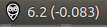

Need a status bar indicator of your bg values and the delta?
Got your own nightscout site running?

Then this is for you!

Currently working OS: Ubuntu

Future features:
- status icon to match the rate of change (trend arrows)
- Windows 10 support
- MacOSX support

Installing:

Right now, you need to compile it yourself. That means you
need to set up go 1.10 or later, as well as godep. Run dep ensure to install the dependencies. Go developers should be familiar with this. I'm on the fence on wether I should commit the dependencies, suggestions?

If you know what that means, then you can probably handle the rest yourself. Apologies to everyone else, I'll get that sorted soon! In the future I will provide binaries and better instructions.

For those that got it to compile, congratulations! Please copy config.example.json to config.json, adjust the values, and run it! Set DefaultMmol to false to default to mg/dl, and you can always change it by right clicking on the statusbar icon.

If the status icon blinks red something went wrong, it couldn't contact your nightscout instance. Make sure your api secret is sha1 hashed and your nightscout host is the host portion only, do not include the https:// or the path portion.

This project was inspired by and enabled by the wonderful Nightscout project.
